# Roteiro Prático - ToDo List

## TodoListAngular

Neste roteiro iremos criar umam aplicação de lista de tarefas. Para o correto desenvolvimento desta aplicação, serão necessários os seguintes pré-requisitos:

    Node;
    Npm;
    Angular-cli instalado e configurado;
    Editor de códigos da sua preferência (sugestões: Visual Studio Code ou Sublime).

### Passo 1

Com o angular-cli instalado, inicialize uma nova aplicação com o comando ng new todo-list-angular. Coloque as seguintes respostas para as respectivas perguntas (N para o angular routing e CSS para o stylesheet format):
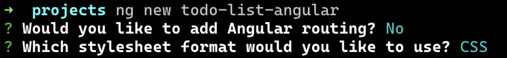

Acesse a pasta no terminal utilizando o comando cd todo-list-angular e em seguida rode o comando npm start. Você deverá ver uma tela parecida como essa no seu terminal. Deverá ser possível também visualizar a aplicação rodando no endereço http://localhost:4200

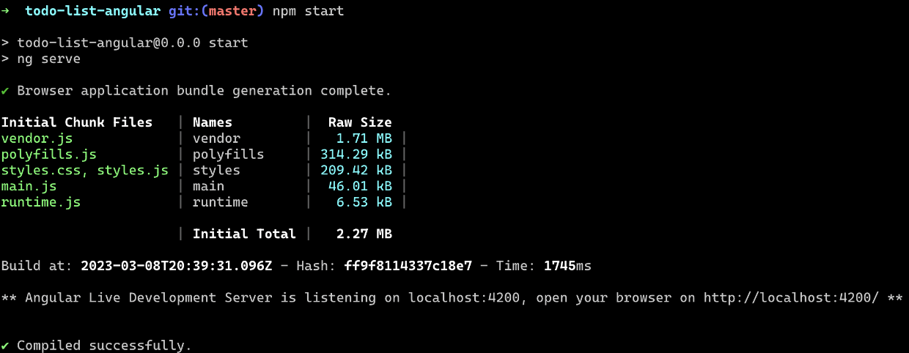

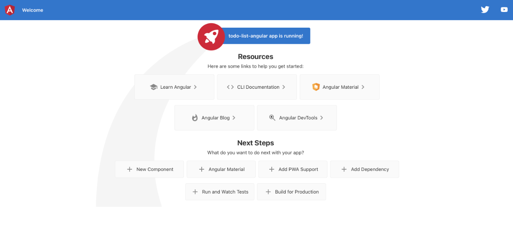

### Passo 2

Com a aplicação em pleno funcionamento, vamos criar dois componentes via linha de comando que serão utilizados posteriormente para compor a nossa lista de tarefas. Para isso, rode os comandos:

<ul>
    <li>ng generate component todo-list</li>
    <li>ng generate componente todo-item</li>

</ul>

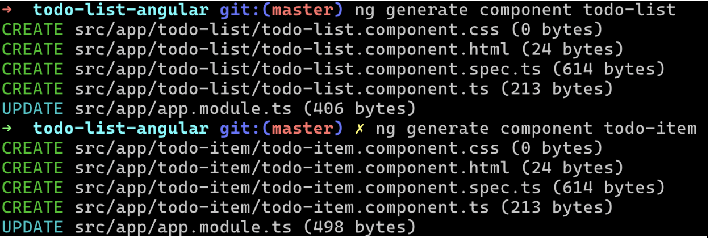

### Passo 3

Abra o arquivo **app.component.html** e delete TODO o conteúdo dentro do arquivo. Iremos atualizá-lo posteriormente. Abra o arquivo **app.module.ts** e logo abaixo do **BrowserModule**, adicione o módulo **FormsModule**. Esse módulo é responsável por habilitar a funcionalidade de _two-way binding_, que será utilizada para capturar o valor do nosso input e utilizá-lo no nosso controller para adicionar um novo item à nossa lista.

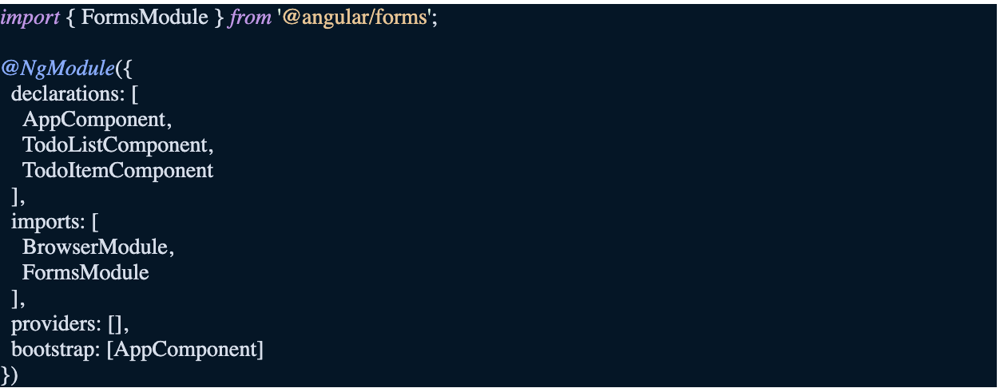

### Passo 4

Vamos criar o nosso componente **TodoItemComponent**. Este componente será responsável por renderizar o conteúdo relacionado ao item individual da nossa lista de tarefas. O comportamento será basicamente mostrar o nome da tarefa juntamente com um checkbox. Ao clicar no checkbox, a classe “completed-task” deverá ser adicionada ao elemento spam, mostrando um estilo como este aqui: ~~palavra-riscada~~. Substitua o conteúdo do arquivo **todo-item.component.ts** pelo seguinte código:

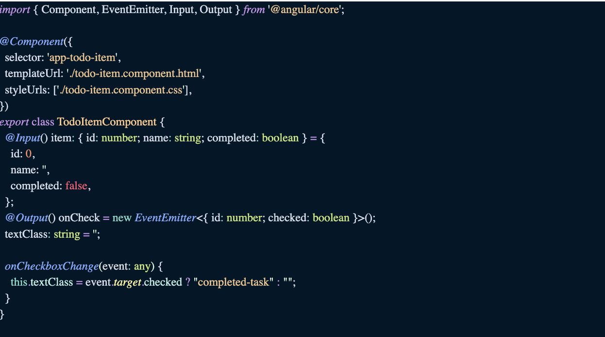

adicione também, no arquivo **todo-item.component.css** o seguinte estilo:

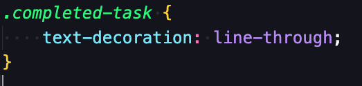

No arquivo **todo-item.component.html**, substitua o conteúdo pelo seguinte código:

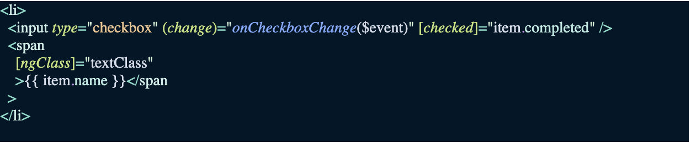

### Passo 5

O componente TodoListComponent será responsável por conter um array com todos os itens da nossa lista. Ele também deverá ter implementado a função **addNewItem()**, que será responsável por capturar o valor do input e adicionar como uma tarefa no nosso array.

O conteúdo do arquivo **todo-list.component.ts** deverá ficar da seguinte maneira:
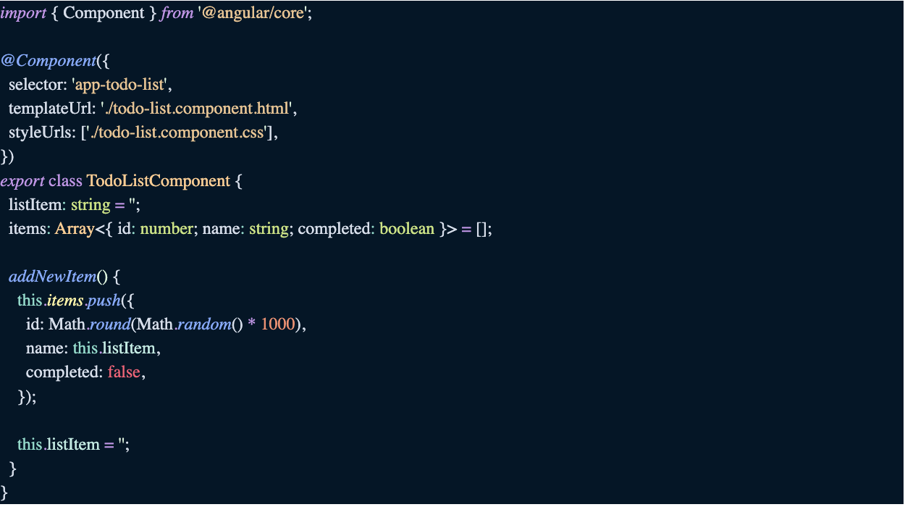

Substitua o conteúdo do arquivo **todo-list.component.html** pelo seguinte código:

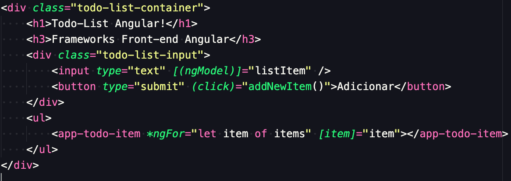

Finalmente acrescente ao arquivo **app.component.html**

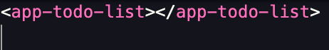

### O resultado final deverá ficar como a imagem abaixo:

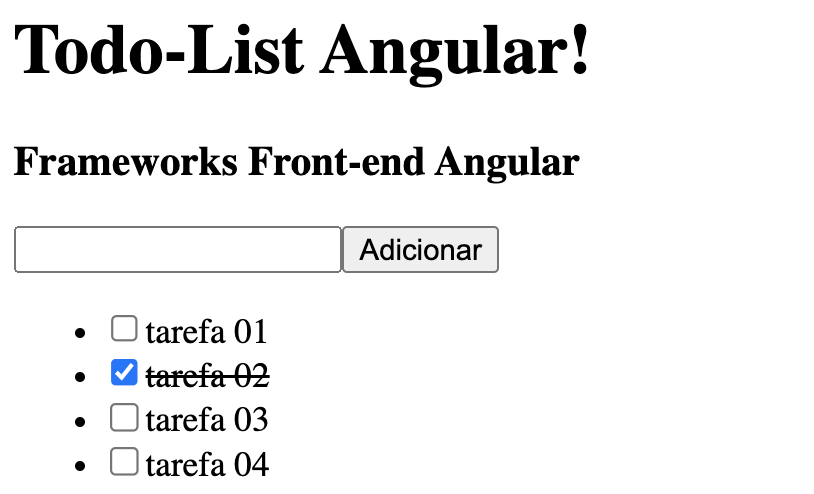

---

# TodoListAngular

This project was generated with [Angular CLI](https://github.com/angular/angular-cli) version 16.0.0.

## Development server

Run `ng serve` for a dev server. Navigate to `http://localhost:4200/`. The application will automatically reload if you change any of the source files.

## Code scaffolding

Run `ng generate component component-name` to generate a new component. You can also use `ng generate directive|pipe|service|class|guard|interface|enum|module`.

## Build

Run `ng build` to build the project. The build artifacts will be stored in the `dist/` directory.

## Running unit tests

Run `ng test` to execute the unit tests via [Karma](https://karma-runner.github.io).

## Running end-to-end tests

Run `ng e2e` to execute the end-to-end tests via a platform of your choice. To use this command, you need to first add a package that implements end-to-end testing capabilities.

## Further help

To get more help on the Angular CLI use `ng help` or go check out the [Angular CLI Overview and Command Reference](https://angular.io/cli) page.
